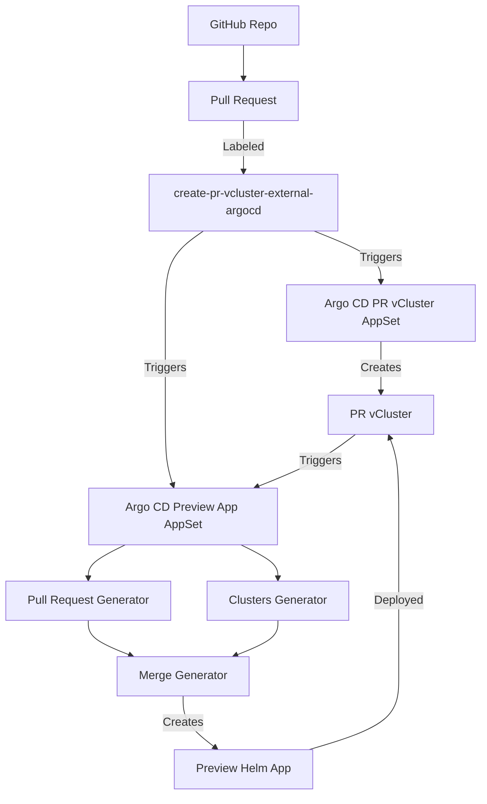

# PR vCluster with Shared Argo CD Flow

```mermaid
---
config:
  look: classic
---
flowchart TD
    A["GitHub Repo"] --> B["Pull Request"] -->| Labeled | L[create-pr-vcluster-external-argocd] 
    L -->| Triggers | C["Argo CD PR vCluster AppSet"]
    C -->| Creates | V["PR vCluster"]
    L --> | Triggers |AS["Argo CD Preview App AppSet"]
    V --> | Triggers |AS["Argo CD Preview App AppSet"]
    AS --> MP["Pull Request Generator"]
    AS --> MC["Clusters Generator"]
    MP --> MG["Merge Generator"]
    MC --> MG["Merge Generator"]
    MG -->| Creates | APP["Preview Helm App"]
    APP --> | Deployed | V
```
