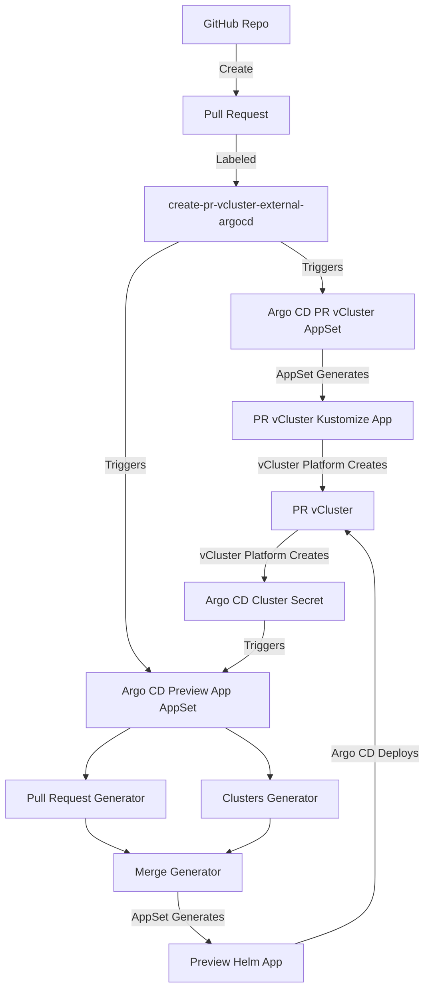

# PR vCluster Using vCluster Platform with Shared Argo CD Flow

```mermaid
---
config:
  look: classic
---
flowchart TD
    A["GitHub Repo"] -->| Create | B["Pull Request"] -->| Labeled | L[create-pr-vcluster-external-argocd] 
    L -->| Triggers | C["Argo CD PR vCluster AppSet"]
    C -->| AppSet Generates | VA["PR vCluster Kustomize App"]
    VA --> | vCluster Platform Creates |V["PR vCluster"]
    V --> | vCluster Platform Creates |CS["Argo CD Cluster Secret"]
    L --> | Triggers |AS["Argo CD Preview App AppSet"]
    CS --> | Triggers |AS["Argo CD Preview App AppSet"]
    AS --> MP["Pull Request Generator"]
    AS --> MC["Clusters Generator"]
    MP --> MG["Merge Generator"]
    MC --> MG["Merge Generator"]
    MG -->| AppSet Generates | APP["Preview Helm App"]
    APP --> | Argo CD Deploys | V
```
