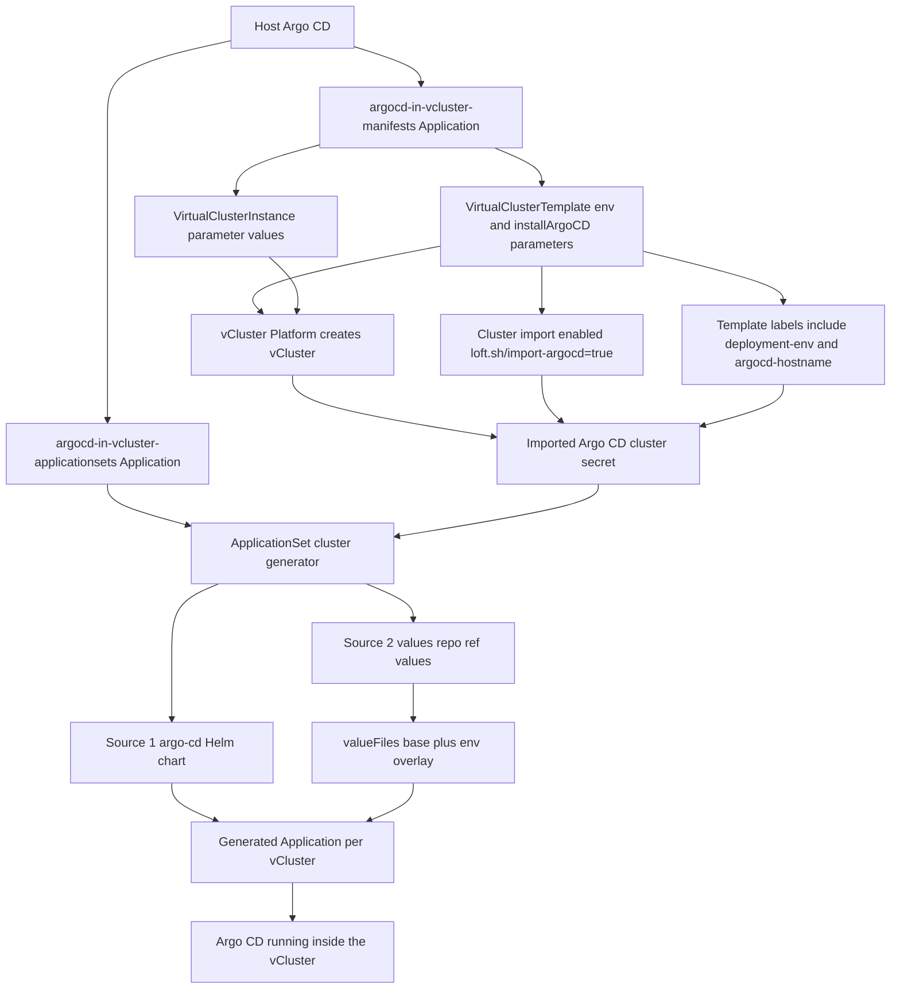

# Argo CD Inside vCluster with Virtual Cluster Templates

This use case creates a vCluster from a **vCluster Platform** `VirtualClusterTemplate`, imports that vCluster into the host Argo CD instance through the [vCluster Platform Argo CD integration](https://www.vcluster.com/docs/platform/integrations/argocd), and then uses an Argo CD `ApplicationSet` to install a dedicated Argo CD instance inside the vCluster.

The Argo CD Helm values are pulled from Git with an environment-aware path that is derived from a vCluster template parameter (`env`).

## Overview

This is a two-level GitOps pattern:

- The host-cluster Argo CD instance manages the vCluster template and the vCluster instance.
- The host-cluster Argo CD instance also sees the new vCluster as a destination cluster because the template enables Argo CD import.
- An `ApplicationSet` running in the host-cluster Argo CD selects that imported cluster and deploys the `argo-cd` Helm chart into the vCluster.
- The `ApplicationSet` uses Argo CD multi-source (`sources`) to combine:
  - the Argo CD chart source, and
  - a Git source (`ref: values`) that provides base and environment-specific values files.

The result is a bootstrap Argo CD on the host cluster and an isolated Argo CD installation running inside the tenant or demo vCluster.

## Environment-Driven Values from Git

This setup supports environment-specific Argo CD configuration by mapping a vCluster template parameter to a values file path:

1. The `VirtualClusterTemplate` defines an `env` parameter (`dev`, `qa`, `prod`).
2. The template writes the selected value to the vCluster label `vcluster.demo/deployment-env`.
3. The imported Argo CD cluster secret carries that label.
4. The `ApplicationSet` uses that label in the second `valueFiles` entry:
   - `.../helm-values/argocd/{{ index .metadata.labels "vcluster.demo/deployment-env" }}/values.yaml`

Values layering for each generated Argo CD installation:

- Base values: [`helm-values/argocd/values.yaml`](./helm-values/argocd/values.yaml)
- Environment overlay:
  - [`helm-values/argocd/dev/values.yaml`](./helm-values/argocd/dev/values.yaml)
  - [`helm-values/argocd/qa/values.yaml`](./helm-values/argocd/qa/values.yaml)
  - [`helm-values/argocd/prod/values.yaml`](./helm-values/argocd/prod/values.yaml)

The hostname and URL values are also set dynamically from template-derived labels (`vcluster.demo/argocd-hostname`) through Helm parameters in the `ApplicationSet`.

## Flow Diagram



## Manifest Breakdown

[`manifests/argocd-in-vcluster-template.yaml`](./manifests/argocd-in-vcluster-template.yaml) defines the `VirtualClusterTemplate`.

- `loft.sh/import-argocd: 'true'` enables Argo CD cluster import for vCluster instances created from this template.
- The template adds instance labels including:
  - `addons.vcluster.demo/argocd` (selector toggle)
  - `vcluster.demo/deployment-env` (derived from the `env` parameter)
  - `vcluster.demo/argocd-hostname` (used for dynamic Argo CD URL/ingress settings)
  - `vcluster.demo/namespace`, `vcluster.demo/project`, and `vcluster.demo/owner`
- Those labels are propagated to the imported Argo CD cluster secret and become usable by the `ApplicationSet` cluster generator.
- The template also enables ingress sync to the host, embedded etcd, embedded CoreDNS, and custom links for the Argo CD endpoint.

[`manifests/argocd-in-vcluster-instance.yaml`](./manifests/argocd-in-vcluster-instance.yaml) creates a `VirtualClusterInstance` from that template.

- It references template version `1.0.x`.
- It sets `installArgoCD: true`.
- It can set `env` (or default to `dev`) to select the environment-specific Argo CD values file.
- `installArgoCD` drives the `addons.vcluster.demo/argocd` label rendered by the template, which is the selector used later by the `ApplicationSet`.

[`apps/argocd-in-vcluster-manifests.yaml`](./apps/argocd-in-vcluster-manifests.yaml) is the host Argo CD `Application` that syncs the template and instance manifests into the management cluster.

[`apps/argocd-in-vcluster-applicationsets.yaml`](./apps/argocd-in-vcluster-applicationsets.yaml) is the host Argo CD `Application` that syncs the `ApplicationSet` definitions.

[`applicationsets/argocd-in-vcluster-cluster-gen.yaml`](./applicationsets/argocd-in-vcluster-cluster-gen.yaml) contains the logic that installs Argo CD inside the imported vCluster.

- It uses the Argo CD `clusters` generator.
- It selects only imported clusters labeled `addons.vcluster.demo/argocd: "true"`.
- For every matching cluster, it creates an `Application` named `argocd-{{.name}}`.
- It uses `sources` to combine the chart and a Git values source (`ref: values`).
- It applies two value files:
  - a shared base file
  - an environment overlay selected by `vcluster.demo/deployment-env`
- It sets Helm parameters for `global.domain`, `configs.cm.url`, and `server.ingress.hostname` from `vcluster.demo/argocd-hostname`.

## Why This Works

The key mechanism is the label handoff between vCluster Platform and Argo CD:

1. The template enables Argo CD import and stamps metadata labels onto the vCluster instance.
2. vCluster Platform creates or updates the Argo CD cluster secret for that vCluster.
3. The `ApplicationSet` cluster generator filters those secrets by label (`addons.vcluster.demo/argocd`).
4. The generated Argo CD `Application` reads chart values from Git using the deployment environment label.
5. Matching vCluster instances automatically receive an Argo CD installation with environment-specific settings.

This makes Argo CD installation an opt-in add-on controlled by template parameters, while keeping Argo CD values centralized in Git and reusable across environments.

## Key ApplicationSet Snippet (Multi-Source Values)

```yaml
spec:
  template:
    spec:
      sources:
        - repoURL: ghcr.io/argoproj/argo-helm
          chart: argo-cd
          targetRevision: 9.4.10
          helm:
            valueFiles:
              - $values/vcluster-use-cases/argocd-in-vcluster/helm-values/argocd/values.yaml
              - '$values/vcluster-use-cases/argocd-in-vcluster/helm-values/argocd/{{ index .metadata.labels "vcluster.demo/deployment-env" }}/values.yaml'
        - repoURL: https://github.com/{REPLACE_ORG_NAME}/{REPLACE_REPO_NAME}.git
          targetRevision: '{REPLACE_GIT_TARGET_REVISION}'
          ref: values
```

## Argo CD Workload for the vCluster

Once your vCluster, with Argo CD installed, is up and running you will be able to create an Argo CD `Applications` inside the vCluster, for example:

```yaml
apiVersion: argoproj.io/v1alpha1
kind: Application
metadata:
  name: guestbook
  namespace: argocd
spec:
  project: default
  source:
    repoURL: https://github.com/argoproj/argocd-example-apps
    targetRevision: '{REPLACE_GIT_TARGET_REVISION}'
    path: guestbook
  destination:
    server: https://kubernetes.default.svc
    namespace: guestbook
  syncPolicy:
    automated:
      prune: true
      selfHeal: true
    syncOptions:
      - CreateNamespace=true
```
